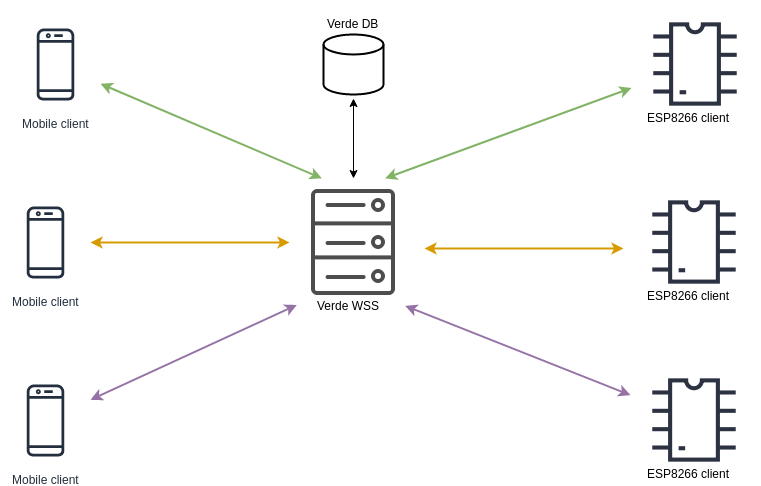

# Verde WebSockets Server

VWSS is a Node.js project which builds a WebSockets Server. It is Internet exposed, so clients can connect to it. The possible clients are: [`Verde pot`](https://github.com/DIuliana/verde-pot-controller/) and `Verde mobile`.

This Server will enable the above 2 clients to exchange messages in real-time and in both directions. It will do this by acting as a proxy between the 2, having the responsibility of correctly route the messages and manage all client sockets.



The Server exposes 2 endpoints on which the 2 types of clients will be able to connect.

The mobile client will connect to:
`ws://b5ec4d23.ngrok.io/verde/socket/mobile/{id}`

The ESP8266 client will connect to:
`ws://b5ec4d23.ngrok.io/verde/socket/pot/{id}`

The 2 endpoints are necessary because the server must link the mobile client with the ESP8266 client and it needs to know who is who. It will do this by grouping the WebSockets by the `id` parameter given in the URL. `id` will be the ESP8266 SAP ssid and it will be unique. The object representation of the above connections will look like:


```json
{  
   "Verde_xxxxxxxxxxx":{  
      "pot":{  
         "_events":{},
         "_eventsCount":0,
         "readyState":0,
         "protocol":"",
         "_binaryType":"",
         "_closeFrameReceived":false,
         "_closeFrameSent":false,
         "_closeMessage":"",
         "_closeTimer":{},
         "_closeCode":1006,
         "_extensions":{},
         "_isServer":false,
         "_receiver":{},
         "_sender":{},
         "_socket":{}
      },
      "mobile":{  
         "_events":{},
         "_eventsCount":0,
         "readyState":0,
         "protocol":"",
         "_binaryType":"",
         "_closeFrameReceived":false,
         "_closeFrameSent":false,
         "_closeMessage":"",
         "_closeTimer":{},
         "_closeCode":1006,
         "_extensions":{},
         "_isServer":false,
         "_receiver":{},
         "_sender":{},
         "_socket":{}
      }
   }
}
```

For every client connection a WebSocket will be opened on the server, the above grouping will be applied and the resulting  object will be persisted into the DB.

For being able to exchange messages, the both clients must have a WebSocket on the Server(i.e. they are connected to the WSS). This means that the Server will have `2 * Verde pot` number of opened WebSockets at any given time.
